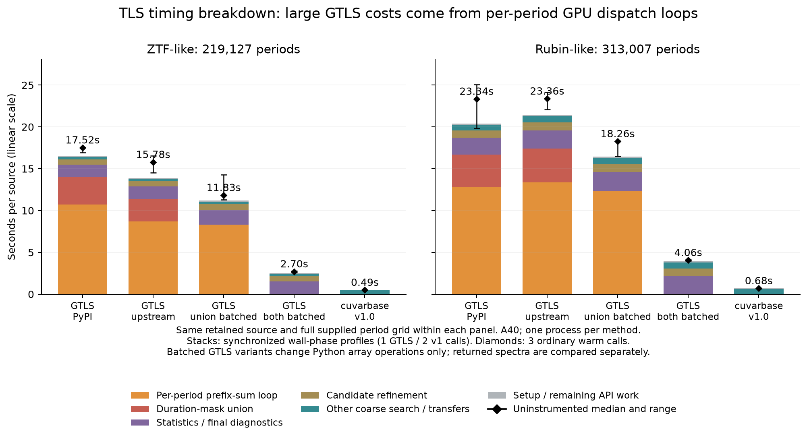

The large TLS API timing difference is real on these two retained inputs, but most of GTLS's measured time is avoidable Python-to-GPU dispatch work. This experiment explains that difference; the separate [recovery benchmark](../transit-recovery-20260908/PROTOCOL.md) determines whether a useful speed advantage survives sensitivity checks on ZTF and TESS workloads.

| One-source warm API, A40 | ZTF-like | Rubin-like |
|---|---:|---:|
| GTLS PyPI 0.4.4 | 17.52 s | 23.34 s |
| GTLS upstream 0.5.1 | 15.78 s | 23.36 s |
| Upstream, batched duration union | 11.83 s | 18.26 s |
| Upstream, both loops batched | 2.70 s | 4.06 s |
| Frozen cuvarbase v1 | 0.489 s | 0.683 s |

These are medians of three uninstrumented warm calls on one source per profile, with complete original period grids (219,127 / 313,007 trials). The figure stacks separately instrumented, synchronized wall phases, with the ordinary medians/ranges marked as diamonds. Phase wall times include launch/wait overhead and are not GPU kernel-busy traces. Individual profiles and ordinary calls vary; their totals must not be mixed to compute exact percentages.

On the ZTF example, a 13.91-second upstream profile spends 8.71 seconds making one cumulative-sum call per period and 2.63 seconds repeatedly combining duration masks. Together these consume 81.5% of that profile. Replacing the duration union with a single array reduction leaves the complete periods and chi-square spectrum bit-identical on both examples. Replacing the flux prefix-sum loop with a batched cumulative sum adds a change in floating-point summation order: maximum chi-square differences are 2.08e-6 / 3.84e-6, and SDE changes are 0.000223 / 0.002964. Both examples retain the same best periods. These two host-operation changes yield 5.85× / 5.76× faster GTLS APIs. They are diagnostic patches, not published GTLS performance or proof of numerical equivalence on all inputs.

After these patches, statistics and final diagnostics cost roughly 1–2 seconds, and candidate refinement remains substantial. Source inspection identifies Python sorting of large masked spectra and refinement padded to the coarse chunk size as further possible overhead. We have not measured a patch for those and do not count hypothetical gains. Warm CUDA module compilation/lookup is negligible in these profiles.

cuvarbase's architecture folds into weighted phase bins, evaluates integrated templates and analytically solves their weighted depths, then refines a limited set of candidates against individual observations. GPU launches cover many periods and lightcurves, with cached kernels/templates and duration-dependent phase-bin sizes. The fast TLS engine was introduced in commit c89516a425d113672d3d7564dc6cd9318bd9036c; these architectural gains are not all changes made in phase 5.

GTLS and cuvarbase TLS are in the same template-search family, but they do not compute the same numerical search. GTLS sorts individual samples by phase, samples templates in numbers of observations, estimates depth from an unweighted window mean and template overshoot, then evaluates weighted residuals. cuvarbase fits weighted template depth analytically on phase bins before local refinement. Template reference geometries, duration/epoch grids, refinement candidate policies, and the spectrum used for SDE also differ. Equal limb-darkening coefficients or a shared period array do not remove those differences. A short GTLS residual-kernel phase does not establish that cuvarbase has a faster version of that particular kernel; much of the work occurs in different places and at different fidelity.

The input-signal criticism in the earlier BLS discussion was overstated. A sinusoid or noise input does not invalidate a timing comparison when the same arrays and fixed search are supplied to every implementation. Signal injections become necessary for recovery/sensitivity claims. Independently searching each band and pooling a normalized common transit are different workloads, which affects representativeness rather than fairness within the original per-band timing contract. GTLS also has a mean-depth gate, so signal/noise values can influence how much residual work it executes.

The CPU TLS errors have two concrete causes in transitleastsquares 1.32:

* On the retained PS1/Gaia examples, a short duration rounds to a template with no in-transit samples; template-cache construction attempts a minimum of an empty array. The search has not started.
* On ZTF/Rubin, the period search completes, but the output model uses `int(number_of_observations / number_of_predicted_transit_occurrences)` samples. That becomes zero for sparse, long-baseline lightcurves, and generating the returned plotting model fails. The ZTF search found the correct 1.668944585-day period and SDE 29.22 before this failure. Calling this a failed period search would be inaccurate.

The failure diagnostics retain tracebacks, selected local variables, and the already-computed ZTF/Rubin spectra. They do not repair the numerical search. First-call failure times include compilation and are not successful warm CPU API benchmarks; batch timeouts are not converted into speedups. Pinned CPU source is under [sources/cpu-tls](sources/cpu-tls), especially `main.py` and `transit.py`.

Evidence: [timing_summary.csv](timing_summary.csv), [phase_timings.csv](phase_timings.csv), [ablation_output_comparison.csv](ablation_output_comparison.csv), [verification.json](verification.json), and all raw JSON/NPZ outputs under [results](results). The transferred archive is 49,305,600 bytes with SHA256 `3f271d3d46d6baf49926952a6e888889b64488900d34e05e2b606906e33063ef`. All 95 transferred files and 14 diagnostic jobs are accounted for. Installed runtime source hashes match the pinned archives; two upstream `.cu` reference snapshots are not installed by GTLS, whose actual runtime CUDA string in `GPUFun.py` is verified.

The A40 rental was $0.49/hour with a 7.65-CPU-equivalent quota on an Intel Xeon Gold 6342 host. This pod also served the completed recovery campaign. All three campaign nodes are now terminated and verified absent. Total estimated rental, including earlier campaigns once, is $8.03 against the authorized $50. See the [final ledger](../transit-recovery-20260908/rental-ledger.json) and [measured speed/recovery report](../transit-recovery-20260908/README.md).

Git includes the reports, figures, measurement records and verification receipts. Full input/output arrays for this earlier campaign remain in the local archive; see [archive contents](ARCHIVE.md).
