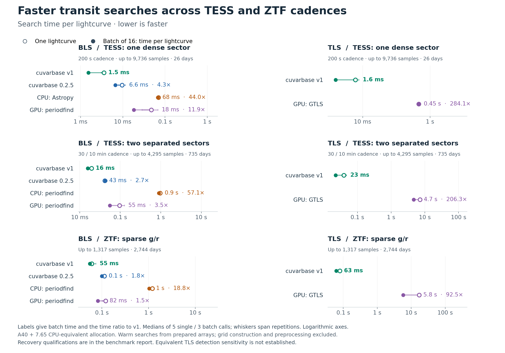

**Scope of this retained experiment:** its BLS competitor results remain current. Its initial TLS timing and sensitivity comparison is superseded for release claims by the [larger independent TLS study](../tls_sensitivity_2026-09-09/README.md). The [current combined figure and report](../../../docs/TRANSIT_BENCHMARKS.md) use that follow-up. Measurements below retain their original interpretation.

This benchmark measures the practical cuvarbase upgrade: prepared-array transit-search time, together with recovery on independent injections. The timing figure shows single-source latency and throughput for 16 distinct sources. Recovery and false-positive results are reported in the tables below. Numerical speed ratios are qualified by the sensitivity actually demonstrated below.

The clearest supported upgrade is BLS on separated TESS sectors: **2.73× faster batch searches, or 10.18× faster fresh grid plus single-source search**, with the same 89/128 held-out transit detections as PyPI and a supported detection/false-positive comparison. Across the three examples, TLS batch searches are **93–284× faster than public GTLS**, but this experiment does **not establish equivalent detection sensitivity** for TLS. On ZTF, v1 detects more transits and also accepts more nulls. Those two findings belong together in any release claim.

[Vector figure: PDF](benchmark_story.pdf) · [Editable SVG](benchmark_story.svg) · [Frozen protocol](PROTOCOL.md)

Times include host preparation inside the API, transfers, periodograms and candidate ranking. Inputs, explicit period grids and GPU contexts are prepared before timing. Detrending, grid construction, imports, disk I/O, catalog vetting and idle time are outside these numbers. Initial setup and first API calls are retained in the timing table; these are fresh processes with already-populated disk caches, not pristine installations.

| Workload | Comparison | Single-source speedup | Batch throughput speedup | Primary-period recovery | Detection + false positives |
|---|---|---:|---:|---|---|
| TESS 200 s | BLS v1 vs BLS PyPI 0.2.5 | 2.69× | 4.31× | Not established | Not established; see recovery difference |
| TESS 200 s | BLS v1 vs CPU Astropy | 19.66× | 43.99× | Not established | Not established; see recovery difference |
| TESS 200 s | BLS v1 vs BLS periodfind GPU | 13.20× | 11.90× | Noninferiority supported | Supported within 5 pp |
| TESS 200 s | TLS v1 vs GTLS upstream | 75.01× | 284.14× | Not established | Not established; see recovery difference |
| TESS separated sectors | BLS v1 vs BLS PyPI 0.2.5 | 2.12× | 2.73× | Noninferiority supported | Supported within 5 pp |
| TESS separated sectors | BLS v1 vs CPU periodfind | 49.20× | 57.10× | Noninferiority supported | Not established; see recovery difference |
| TESS separated sectors | BLS v1 vs BLS periodfind GPU | 4.92× | 3.51× | Noninferiority supported | Not established; see recovery difference |
| TESS separated sectors | TLS v1 vs GTLS upstream | 181.25× | 206.32× | Not established | Not established; see recovery difference |
| ZTF g/r | BLS v1 vs BLS PyPI 0.2.5 | 1.86× | 1.82× | Noninferiority supported | Not established; see recovery difference |
| ZTF g/r | BLS v1 vs CPU periodfind | 19.77× | 18.77× | Not established | Not established; see recovery difference |
| ZTF g/r | BLS v1 vs BLS periodfind GPU | 1.97× | 1.49× | Not established | Not established; see recovery difference |
| ZTF g/r | TLS v1 vs GTLS upstream | 214.54× | 92.51× | Noninferiority supported | Not established; see recovery difference |

For dense TESS, the CPU batch comparison uses Astropy workers across independent sources. On the tuning inputs this is 1.11× faster than the period-parallel single-source scheduling policy. All 384 independent calibration/held-out spectra and candidates are bit-identical under both schedules. Single-source timing retains period-parallel workers. [Scheduling evidence](cpu-operational-selection.json).

“Supported” means the one-sided 95% lower bound on paired v1-minus-comparator detection recall exceeds −5 percentage points, and the corresponding upper bound on the false-positive increase is below +5 points. This is a pooled result for the equally weighted SNR mixture in this experiment; inspect the per-SNR tables for tradeoffs. It does not mean identical algorithms, exactly equal recall, or a universal sensitivity guarantee. Unmarked speed ratios are measured timing differences; they must not be advertised as demonstrated equivalent-sensitivity speedups. “Not established” can reflect a measured loss or insufficient precision; it does not itself prove inferiority.

Independent per-star searches can also require a new period grid. The following measurements put each release’s native Keplerian grid construction, endpoint trimming and one BLS search inside the timer. The fresh grids have bit-identical GPU float32 frequencies and duration bounds; the small float64 differences are retained. This separate boundary is relevant to QLP workloads that cannot reuse one grid across sources.

| Workload | v1 fresh grid + search | PyPI fresh grid + search | Speedup | Single-source detection match |
|---|---:|---:|---:|---|
| TESS 200 s | 6.15 ms | 25.9 ms | 4.22× | Not established |
| TESS separated sectors | 59.4 ms | 0.605 s | 10.18× | Supported within 5 pp |
| ZTF g/r | 0.179 s | 1.91 s | 10.68× | Not established |

| Workload | Method | Correct primary period / 128 | Detected at correct period / 128 | False positives / 128 | Invalid held-out outputs |
|---|---|---:|---:|---:|---:|
| TESS 200 s | BLS v1 | 59 | 49 | 3 | 0 |
| TESS 200 s | BLS v1 batch | 59 | 49 | 3 | 0 |
| TESS 200 s | BLS PyPI 0.2.5 | 63 | 50 | 3 | 0 |
| TESS 200 s | BLS external CPU | 59 | 48 | 5 | 0 |
| TESS 200 s | BLS periodfind GPU | 50 | 39 | 7 | 0 |
| TESS 200 s | TLS v1 | 63 | 56 | 7 | 0 |
| TESS 200 s | GTLS single | 69 | 59 | 8 | 0 |
| TESS 200 s | GTLS batch | 69 | 59 | 8 | 0 |
| TESS separated sectors | BLS v1 | 95 | 89 | 6 | 0 |
| TESS separated sectors | BLS v1 batch | 95 | 89 | 6 | 0 |
| TESS separated sectors | BLS PyPI 0.2.5 | 96 | 89 | 7 | 0 |
| TESS separated sectors | BLS external CPU | 86 | 74 | 7 | 0 |
| TESS separated sectors | BLS periodfind GPU | 86 | 74 | 7 | 0 |
| TESS separated sectors | TLS v1 | 92 | 78 | 2 | 0 |
| TESS separated sectors | GTLS single | 95 | 74 | 2 | 0 |
| TESS separated sectors | GTLS batch | 95 | 74 | 2 | 0 |
| ZTF g/r | BLS v1 | 101 | 93 | 9 | 0 |
| ZTF g/r | BLS v1 batch | 101 | 93 | 9 | 0 |
| ZTF g/r | BLS PyPI 0.2.5 | 94 | 88 | 11 | 0 |
| ZTF g/r | BLS external CPU | 99 | 90 | 6 | 0 |
| ZTF g/r | BLS periodfind GPU | 99 | 90 | 6 | 0 |
| ZTF g/r | TLS v1 | 108 | 103 | 10 | 0 |
| ZTF g/r | GTLS single | 103 | 96 | 3 | 0 |
| ZTF g/r | GTLS batch | 103 | 96 | 3 | 0 |

TLS can return a finite native candidate while representing trial periods with no admissible fit as NaN. These are distinct from an API exception or missing candidate. The experiment retains that native masking and calibrates the resulting score, and separately counts the masked trials: TESS 200 s TLS v1: 22 calibration / 0 held-out trial periods, across 4 / 0 light curves. The full returned spectra and counts are retained.

Each method’s detection threshold is the higher empirical 95th percentile of 128 independent calibration nulls. The held-out set contains 128 injections and 128 new nulls per observing pattern. The per-SNR tables contain 32 injections at each white-noise oracle SNR (6, 8, 10, 14), with 95% Wilson intervals. This SNR excludes the additional correlated residual and is neither native TLS SDE nor QLP pink-noise SNR. Achieved false-positive rates and paired differences are in [recovery_summary.csv](recovery_summary.csv), [recovery_by_snr.csv](recovery_by_snr.csv), and [paired_comparisons.csv](paired_comparisons.csv).

Real cadence, controlled flux: the experiment uses public ZTF g/r times and relative errors, plus public QLP times/quality flags for one dense TESS sector and a controlled pair of separated sectors. Fluxes are simulated exposure-integrated batman transits with heteroscedastic Gaussian noise and an OU residual. Injections require at least five observed in-transit points and two observed events. Known band baselines and achromatic transits are supplied. These three cadence examples are not a random catalog sample, injections into observed flux, unconditional survey completeness, or a reproduction of the full current QLP pipeline.

A long gap matters to timing because the longer baseline requires finer trial-period spacing to keep a transit aligned. TESS 200 s uses 4,133 BLS / 3,084 TLS periods; separated TESS sectors use 128,964 / 99,043; ZTF uses 423,781 / 312,064. BLS and TLS have different minimum periods, so comparisons are within each algorithm. A simulated sinusoid or noise does not invalidate a fixed-grid timing comparison on identical arrays; transits are needed here to establish recovery. GTLS’s mean-depth gate can also make flux values affect its execution time.

Configuration selection used only 32 tuning injections per survey. The fastest complete choice within one recovery of the best in each family was retained, with close timings repeated. CPU candidates included Astropy, periodfind’s Rust implementation and fBLS; GPU BLS included periodfind. This identifies the strongest tested competitor for these workloads, not the fastest code that could exist. Selected versions, settings, exclusions and repeat evidence are in [selection.json](selection.json); operational choices are recorded separately when applicable.

BLS gains come from reusing folded phase histograms for several phase offsets, a vectorized maximum-bin scan and grid generator, and a public batch API that amortizes per-source work. Both releases receive warmed kernels and reusable PyPI memory in this experiment; compilation caching is not credited as a cause of the remaining warm API ratio. Batch throughput has a separate recovery validation. Some tuned searches have different phase sampling and minimum-duration bounds, so the total upgrade ratio is not a pure kernel ablation. The separated-TESS PyPI comparison uses matching duration bounds and phase-pass counts. PyPI 0.2.5 documents `noverlap` as unimplemented in its fast kernel: the adapter uses the documented repeated `dphi` calls, public reusable memory, a GPU maximum and one final transfer. No installed package source is changed.

| Selected BLS settings | v1 phase passes | PyPI phase passes | v1 minimum duration / central duration | PyPI minimum duration / central duration |
|---|---:|---:|---:|---:|
| TESS 200 s | 8 | 4 | 0.5 | 0.25 |
| TESS separated sectors | 4 | 4 | 0.25 | 0.25 |
| ZTF g/r | 8 | 3 | 0.5 | 0.5 |

Both BLS releases use maximum duration 2 times the central duration and dlogq=0.1. The minimum-duration factor was among the tuning choices; the selected 0.25 values widen the initial QLP-inspired 0.5 lower bound. TLS v1 uses epoch oversampling 4 and 16 durations, with 50 candidates refined; its fractional-duration window is 0.5–2 times the central value. GTLS uses its documented fast mode, duration_grid_step=1.1 and stellar-radius bounds 0.5–2 solar radii at one solar mass. Those GTLS physical bounds do not make its discrete template-duration/epoch search identical to v1’s. These are selected benchmark settings, not a claim about the exact current QLP production configuration.

The external BLS implementations have additional numerical differences. Astropy and periodfind accept scalar duration bounds, approximated here with 16 logarithmic period chunks covering the same density prior. periodfind searches brightening and dimming boxes, whereas cuvarbase/Astropy are configured for dimmings; its public output does not expose a dip-only switch. periodfind’s long-lightcurve GPU branch has a fixed 64-bin array, so the dense TESS comparison uses a valid capped setting. Unchecked larger-bin calls crashed and are excluded. fBLS native-grid pilots and failures remain in the evidence; failures and timeouts do not supply speedup denominators.

TLS gains combine architecture and host orchestration. cuvarbase folds into weighted phase bins, evaluates integrated templates and analytically solves weighted depths, then refines a limited candidate set against observations. GTLS sorts phase-folded samples, represents template widths in observation counts, estimates depth from an unweighted window mean and template overshoot, and evaluates weighted residuals. Epoch/duration grids, geometry, refinement and SDE construction differ. These are related template searches, not numerically identical algorithms. The fast cuvarbase TLS engine predates phase 5; the whole gain cannot be attributed to that phase.

The separate [TLS component audit](../tls_profile_2026-09-08/README.md) demonstrates substantial avoidable GTLS dispatch overhead. On its two retained diagnostic inputs, batching two Python/CuPy host operations makes GTLS about 5.8× faster while retaining the best periods; one operation is bit-identical and the other changes chi-square by a few parts in 10⁶ in absolute units. Those diagnostic patches are not the public competitor in this figure. The main comparison uses the unmodified public API, including its fast mode when selected by tuning. The remaining API ratio cannot be interpreted as the speed of an otherwise identical residual kernel.

The new component experiment repeats explanatory measurements on all three cadence examples, using a retained tuning injection. The table reports ordinary uninstrumented API medians; synchronized wall-phase fractions are kept separately. The BLS rows disable one feature while retaining scientific settings. The GTLS row enables the two diagnostic host-loop changes. These ablations are not public competitors, are not independent additive savings, and cannot be multiplied to explain the full release ratio.

| Workload | Diagnostic change | Baseline time | Changed time | Changed / baseline time | Same primary period | Maximum spectrum difference |
|---|---|---:|---:|---:|---|---:|
| TESS 200 s | Public unfused phase passes versus fused histogram | 5.43 ms | 8.51 ms | 1.57× | True | 1.02e-08 (BLS chi2 ratio) |
| TESS 200 s | Diagnostic chronological input versus conflict-scattered observation order | 5.43 ms | 5.12 ms | 0.94× | True | 2.79e-09 (BLS chi2 ratio) |
| TESS 200 s | Diagnostic batching of two GTLS host loops | 0.51 s | 0.369 s | 0.72× | True | 0.000865 (native SDE) |
| TESS separated sectors | Public unfused phase passes versus fused histogram | 27.2 ms | 36.7 ms | 1.35× | True | 1.68e-08 (BLS chi2 ratio) |
| TESS separated sectors | Diagnostic chronological input versus conflict-scattered observation order | 27.2 ms | 24.2 ms | 0.89× | True | 9.31e-09 (BLS chi2 ratio) |
| TESS separated sectors | Diagnostic batching of two GTLS host loops | 7.48 s | 2.81 s | 0.38× | True | 0.0387 (native SDE) |
| ZTF g/r | Public unfused phase passes versus fused histogram | 85 ms | 0.12 s | 1.42× | True | 2.61e-08 (BLS chi2 ratio) |
| ZTF g/r | Diagnostic chronological input versus conflict-scattered observation order | 85 ms | 60.2 ms | 0.71× | True | 9.31e-09 (BLS chi2 ratio) |
| ZTF g/r | Diagnostic batching of two GTLS host loops | 17 s | 2.06 s | 0.12× | True | 0.124 (native SDE) |

The fusion ablation increases ordinary BLS API time by 1.35–1.57×. Observation scattering does not demonstrate a benefit on these retained cases: disabling it reduces the measured median by 6–29%. All these ablations retain the primary period, with small spectrum changes. They are three-repetition diagnostics on one tuning injection per cadence, not population sensitivity tests or a new optimized release.

For GTLS, batching the two host loops improves the ordinary single-source API by TESS 200 s 1.38×, TESS separated sectors 2.66×, ZTF g/r 8.24×. This is a demonstrated opportunity for upstream improvement; the figure uses the unmodified public upstream interface. Residual-template evaluation and phase sorting remain after the loop changes. The remaining gap includes cuvarbase’s different search architecture and numerical approximation, so it cannot be advertised as a pure implementation speedup at identical sensitivity.

The validation runs also provide an independent timing sanity check: mean GTLS batch time per injected source is about 3–5% greater than for null sources on these cadences. This is much smaller than the measured API ratio. It is not a causal signal-only ablation: the cohorts also contain independent missing-sample/noise draws and sequential timing variation. [Runtime by cohort](runtime_by_cohort.csv) · [Cohort ratios](runtime_cohort_ratios.csv).

Timing-output audit: 4 source/repetition results change their best period relative to the retained validation run, all in GTLS’s separated-sector batch configuration (two null sources). Every timed repetition returns a valid finite result, and every calibrated null accept/reject decision is unchanged. Other parts of the GTLS batch spectra change by up to 2.60 native SDE units on these timing nulls. GTLS’s memory-dependent chunking and numerical variation mean full spectra and candidates must not be described as universally identical between calls. The full deltas are retained in [timing_analysis.json](timing_analysis.json). PyPI fresh-grid float64 period rounding differences are also recorded; those remain numerically equal at relative tolerance 10⁻¹².

[component_phases.csv](component_phases.csv) gives measured phase times and fractions; [component_summary.csv](component_summary.csv) reports profiling overhead and instrumentation differences; [component_ablations.csv](component_ablations.csv) retains numerical changes. These are synchronized wall regions, including dispatch/wait overhead, not GPU kernel-busy traces. The native GTLS fast-mode spectrum is in SDE units, so its deltas must not be described as chi-square deltas.

| Fraction of synchronized diagnostic API time | TESS 200 s | Separated TESS | ZTF g/r |
|---|---:|---:|---:|
| v1 BLS: common host candidate ranking | 46.8% | 59.0% | 64.2% |
| v1 BLS: synchronized GPU kernel launches | 14.9% | 25.1% | 14.1% |
| PyPI BLS: host maximum-bin scan | 12.1% | 35.7% | 37.1% |
| GTLS: two host-loop regions | 31.7% | 63.6% | 89.1% |
| GTLS: phase folding / sorting | 16.2% | 8.7% | 3.6% |
| GTLS: residual kernel region | 29.4% | 21.9% | 3.6% |
| v1 TLS: coarse kernel region | 14.7% | 38.1% | 31.4% |
| v1 TLS: CPU statistics / results | 12.9% | 26.4% | 34.3% |

These fractions belong to separately instrumented calls on one tuning injection per cadence, not the main batch timing. Synchronization and sequential measurement variation change the total runtime (including shorter profiled calls on some small problems), so do not multiply these percentages by the headline timings. They locate plausible bottlenecks: GTLS host dispatch on large grids and host candidate/statistics work after cuvarbase’s fast kernels.

| Workload | v1 grid construction | PyPI grid construction | Grid-only speedup |
|---|---:|---:|---:|
| TESS 200 s | 1.8 ms | 20 ms | 11.07× |
| TESS separated sectors | 32.1 ms | 0.553 s | 17.21× |
| ZTF g/r | 0.139 s | 1.74 s | 12.54× |

The earlier CPU TLS failures were concrete output/template edge cases in transitleastsquares 1.32. Sparse PS1/Gaia examples constructed a zero-sample transit template before searching. ZTF/Rubin completed the period search, then failed while constructing a zero-sample plotting model; ZTF had already found the correct 1.66894-day period. First-call failure times include compilation and are not successful CPU timings. This requested TLS comparison is v1 versus GTLS; those CPU failures are not converted to speed claims.

| Workload | v1 BLS projected GPU cost / million | v1 TLS projected GPU cost / million | CPU hourly break-even for BLS |
|---|---:|---:|---:|
| TESS 200 s | $0.21 | $0.21 | $0.0111/h |
| TESS separated sectors | $2.14 | $3.08 | $0.0086/h |
| ZTF g/r | $7.50 | $8.54 | $0.0261/h |

Costs use the actual A40 bundle price, $0.49/hour, and linearly project measured batch search time. A standalone CPU at the measured performance would need to cost below the listed break-even price to beat that GPU search cost. No standalone CPU rental was measured. These are search-only rental equivalents, not measured million-star jobs or complete QLP costs. Hardware: A40 and a 7.65-CPU-equivalent quota on an Intel Xeon Gold 6342 host; the 96 host logical CPUs are not the allocation.

Provenance: frozen cuvarbase v1 commit `1032caf029570dc4841db1c594a2cbb1654e8fd8`; PyPI cuvarbase `0.2.5`; GTLS upstream commit `74e449c325792a763dde4fbffab98039c5e8c111`; periodfind commit `116b1b27c8db4c95035b5233efa6a1d21780afa5`. Actual PyPI cuvarbase has no TLS implementation. The legacy environment uses NumPy 1.23.5 / PyCUDA 2022.2.2 and the modern environment NumPy 2.2.6 / PyCUDA 2025.1.2: this measures usable software stacks, not an isolated package-source change. Full environment listings accompany the hardware records. periodfind’s CUDA architecture selection in setup.py was adapted to build on the A40; its numerical sources are unchanged.

Per-job installed-source hashes, input/output SHA256 values, controller exit records and paired success vectors are retained here. The original source archives, frozen harness copies and hardware/transfer records are recoverable from the pinned Git snapshot described in [ARCHIVE.md](ARCHIVE.md). Full periodograms remain in the larger local archive. [provenance-verification.json](provenance-verification.json) records checks of the original complete archive: frozen inputs, actual validation worker/controller, installed code and exclusive final timing intervals. Auxiliary A40 nodes evaluated serial GTLS recovery only; their elapsed times never enter speed ratios.

The maintained [benchmark tools](../../transit/README.md) provide summary analysis, timing plots and individual search workers. Reproduce original orchestration from the frozen harness in Git history; use its original layout when checking historical manifests. Full-array validation requires restoring the periodograms. [timing_summary.csv](timing_summary.csv) records timing boundaries and repetitions, and [speedups.csv](speedups.csv) derives ratios and costs.

All three A40 nodes have been terminated and verified absent. Estimated total RunPod rental for the retained benchmark campaigns is **$8.03**, including the earlier **$3.77** once, against the authorized **$50** limit. This is elapsed rental × quoted rate, not an invoice. [Rental and termination ledger](rental-ledger.json).

The Git checkout includes the frozen transit inputs, per-job JSON records, source snapshots, figures and verification receipts. Full periodograms and transport archives remain in the local experiment archive. See [archive contents and reproduction boundaries](ARCHIVE.md) for what is included and which verification commands require the complete arrays.
