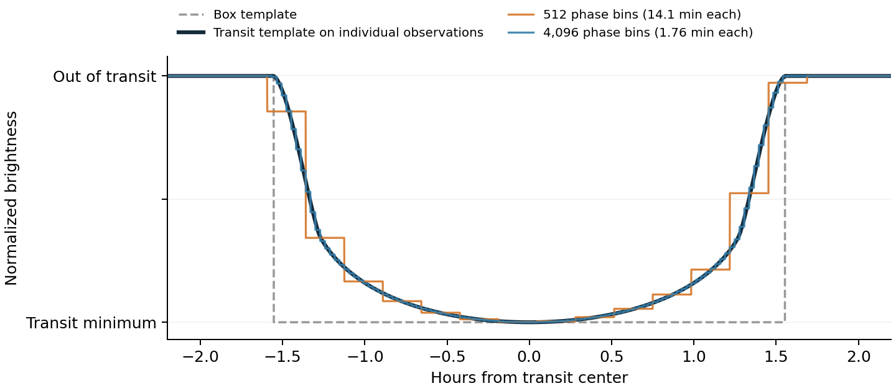

# TLS shape, phase bins and detection accuracy

cuvarbase's fast TLS search retains a limb-darkened transit shape. Its speed comes partly from approximating the coarse search with weighted phase bins and partly from avoiding repeated computation. **The approximation is useful, but there is no universal 1–2% sensitivity-loss guarantee.** Narrow transits can lose substantially more signal, particularly when the bin cap or minimum searched duration becomes limiting.

The September accuracy audit separates three questions: how much expected SNR binning loses at a known period; whether a complete search recovers injected transits at a calibrated false-positive rate; and whether a kernel optimization preserves the existing search. These measurements answer different questions. [Reproducible results](../benchmarks/results/tls_accuracy_2026-09-09/README.md).



This example has a five-day period and a nominal 3.11-hour transit. The original benchmark settings use 512 phase bins: 14.1 minutes per bin, or about 13 bins across the transit. The rounded bottom remains visible; the ingress and egress are coarsened. At 4,096 bins, each bin spans 1.76 minutes. The vertical scale is normalized to the transit depth.

## Where this differs from canonical TLS

The [original TLS paper](https://doi.org/10.1051/0004-6361/201834672) searches unbinned, phase-folded observations using a transit-shaped template. cuvarbase's fast engine uses two stages:

1. For each trial period, fold the observations into weighted phase bins. Search transit durations and epochs using integrated template lookup tables, and solve for depth analytically.
2. Refine the selected candidate periods against individual observations. The benchmark uses the public top-50 refinement.

The first stage saves repeated observation-level work. Its approximation loses the individual positions and flux variation inside each bin. Integrating the template over a bin reduces discretization error; it does not recover that missing information. The kernel averages both the template and its square, which also differs from evaluating the model at each observation's actual phase.

Refinement improves the selected candidates. It cannot recover a period excluded by the coarse search, and the reported SDE still comes from the coarse spectrum. This is why accurate fitted parameters alone do not demonstrate accurate detection sensitivity.

The fast engine also uses its own epoch and duration grids, a fixed fiducial transit shape scaled in duration and depth, and its own ranking/refinement implementation. The current fiducial shape is a central, circular transit with planet/star radius ratio 0.1 and semimajor axis 15 stellar radii. Normalizing its depth does not make its ingress geometry Earth-like. `R_planet` controls the duration prior, not this template geometry. The analytic depth solution is valid for the chosen objective; phase compression and search sampling are separate approximations.

Public GTLS has approximations too. It sorts individual observations by phase, but its cached template widths and positions within each window use observation counts. That differs from evaluating a physical template at each observation's actual phase on irregular cadences. GTLS also skips trial epochs in its coarse search. Its full mode refines selected candidates; the `fast=True` mode benchmarked here returns the coarse periodogram. An unbinned representation alone therefore does not make GTLS an exact physical matched filter. [Pinned implementation comparison](GTLS_COMPARISON.md), [GTLS method](https://arxiv.org/html/2607.00348v1).

cuvarbase's `use_fast=False` path evaluates individual observations, but has a roughly 3,500-point shared-memory limit, its own numerical grids and ordinary float32 folding that loses precision over long baselines. It is not a verified port of canonical CPU TLS. cuvarbase TLS, public GTLS and the canonical CPU package are related searches with different numerical implementations.

## How fine are the benchmark bins?

With epoch oversampling 4, the automatic rule requests at least four bins across the shortest allowed transit, rounds upward to a power of two, and imposes a 256-bin floor. These cadence examples use 256–1,024 bins over the entire phase cycle. Typical central transits span roughly 8–16 bins; the shortest searched durations generally span 4–8, with more at short periods because of the floor. The epoch grid is a separate control, stepping by approximately one quarter of the tested duration here.

These are explicit benchmark settings. The public API defaults to epoch oversampling 3; reproducing the study requires the recorded configuration rather than an unspecified default call.

A small number of bins across ingress does not imply an equally large loss of total detection SNR: the broad transit bottom also carries signal. However, ingress-sensitive measurements, narrow transits and marginal detections can be more demanding than this average picture.

## Why bins across a transit can decrease

Let `q = duration / period`, and let `m` be `t0_oversample`. The automatic rule is approximately

```text
N_bins(P) = clamp(power_of_two_ceiling(m / qmin(P)), 256, device_limit)
```

The implementation limit is 8,192 bins; device shared memory can impose a lower limit. Away from the floor and cap, the shortest searched transit spans between `m` and `2*m` bins. The count falls between power-of-two jumps and rises when the next bin count is selected. A sustained fall below `m` for the **shortest searched width** means the cap or a fixed bin override is limiting. A real transit shorter than the configured `qmin` can have fewer bins even without hitting a cap.

For example, using the default solar duration prior and `m=3`, the 8,192-bin cap first limits the requested minimum width at about 1,064 days. For a star with 0.1 solar mass and radius it starts around 120 days. Those are resolution thresholds, not predictions of recovery loss.

Adapting `N_bins` to each trial duration is computationally possible. One fine histogram could be summed into a hierarchy of coarser histograms for wider trials. It would avoid making wide trials pay for the narrowest width. However, coarsening those trials changes their approximate weights and scores, and would need accuracy and false-positive validation. The current search instead shares the finest required histogram across durations. The new empty-bin optimization keeps that histogram and its trials intact.

## Where losses become significant

The expanded diagnostic uses exposure-integrated physical transits, the actual fixed cuvarbase template and integrated tables, and optimized continuous template and box fits. The following examples use the **API defaults**: automatic bins, epoch oversampling 3, and 15 durations. Values are the largest losses among 32 sampled phase offsets at the true period, under uniform sampling and independent noise; they are not missed-planet percentages.

| Earth-sized planet and host | Bins across transit | Additional SNR loss from binning | Coarse-scan SNR loss at true period | Limiting issue |
|---|---:|---:|---:|---|
| Sun, 10-day central transit | 8.4 | 1.2% | 7.7% | Epoch/duration sampling contributes beyond binning |
| Sun, 365-day central transit | 6.1 | 2.1% | 5.5% | Finite resolution; no bin cap |
| Sun, 10 days, impact parameter 0.95 | 2.8 | 5.2% | 17.4% | Transit shorter than default minimum duration |
| 0.1-solar-mass/radius star, 365 days, central | 2.9 | 5.3% | 7.4% | 8,192-bin cap |
| Same small star and period, impact parameter 0.9 | 1.6 | 20.3% | 22.3% | Cap and short transit |
| Sun, 100 days, eccentricity 0.8, impact parameter 0.5, periastron transit | 2.1 | 10.2% | 20.7% | Transit shorter than default minimum duration |

Both loss columns use the best continuous, unbinned **cuvarbase template** as reference. The binning column holds its fitted epoch and duration fixed. The coarse-grid column also includes the allowed duration window, epoch grid and native score's choice of trial. Do not add the columns; their sampled maxima can occur at different offsets and are not universal worst-case bounds. All examples use 200-second integrations and shared quadratic limb-darkening coefficients `[0.4804, 0.1867]`: the dense-star rows are controlled shape/resolution examples, not atmosphere-specific predictions. They establish physically possible failure regimes, not their occurrence rates or observability in a particular survey. Long-period examples require observations spanning enough transits. The full catalog also retains unobserved sparse-cadence examples and labels compact-star stress cases separately.

For small planets, the approximate transit duration relative to a central circular orbit is

```text
sqrt(1 - impact_parameter**2) * sqrt(1 - eccentricity**2)
    / (1 + eccentricity * sin(omega))
```

Thus an impact parameter of 0.95 or a central transit at periastron with eccentricity 0.8 gives roughly one third of the central circular duration, below the default `qmin_fac=0.5` window. In the small-planet, circular approximation, durations already fall below half the central value above impact parameter about 0.87. An Earth/Sun transit at impact parameter 0.95 is high-impact but is not yet grazing. [Transit geometry, Winn (2010), equations 14–19](https://arxiv.org/pdf/1001.2010).

For uniform cases, doubling integration resolution and exposure quadrature changed the eight checked SNR-retention metrics by less than 0.0015 percentage points. This does not refine the 32-offset coverage or validate the observed-cadence fits' convergence. The diagnostic excludes blind period search, noise realizations, correlated noise, threshold calibration and candidate pruning. [Cases, definitions and validation](../benchmarks/results/tls_accuracy_2026-09-09/accuracy/README.md).

## Is 1–2% small compared with TLS versus BLS?

It can consume much of the shape advantage. In the controlled central solar examples, an **optimally positioned and sized box** loses only about 1–1.5% of expected SNR relative to the true physical signal. A box's best detection width need not equal the full transit duration. Losses are larger for some other geometries. These are shape comparisons at a known period, not recovery measurements for a BLS implementation. Their reference is the physical-signal oracle; the preceding table instead isolates additional losses relative to the best fixed TLS template, excluding that template's own shape mismatch. The CSV reports both references explicitly.

The original TLS paper's roughly 93% versus 76% recovery result is a complete-search experiment at 1% false positives; it is not a universal 17% SNR advantage. A small SNR change can move many marginal signals across a detection threshold. Conversely, a 2% SNR loss does not imply exactly 2% fewer detections. [Original TLS experiment](https://arxiv.org/pdf/1901.02015).

## Can GTLS find narrow transits that the defaults miss?

**Yes.** A new focused experiment injected Earth-sized transits with impact parameters 0.94–0.96 and periods 2–6 days into the observed TESS 200-second cadence. Half had oracle white-noise SNR 8 and half SNR 10; the realizations also included correlated noise. Each method received its own threshold from 256 independent calibration nulls before searching 256 new injections and 256 new nulls on the same full 3,084-period grid.

| Search | Detected injections | Test false positives |
|---|---:|---:|
| cuvarbase API defaults | 61/256 (23.8%) | 8/256 (3.1%) |
| cuvarbase fine sampling, same duration window | 78/256 (30.5%) | 8/256 (3.1%) |
| Public GTLS, fast mode | 112/256 (43.8%) | 7/256 (2.7%) |
| cuvarbase wider duration search | 116/256 (45.3%) | 8/256 (3.1%) |

GTLS detected **56 injections missed by the defaults**; the defaults detected five missed by GTLS. The wider cuvarbase search detected 56 missed by the defaults and lost one default detection. All API calls returned valid primary results; native masked or nonfinite trial entries were retained in the accounting. The full common grid was supplied to each method. GTLS's actual template cache included a nominal duration within 4.9% of every injected duration, so an empty duration cache does not explain its result here.

The wider configuration decreases `qmin_fac` from 0.5 to approximately 0.186 and uses 25 log-spaced durations, mathematically retaining the original 15 widths while adding ten shorter ones. It keeps epoch oversampling 3 and automatic bins. Lowering `qmin` also requests finer automatic bins, so this is a practical coverage/resolution improvement, not a pure duration-prior ablation. The fine comparison instead keeps the default duration bounds and uses 8,192 bins, epoch oversampling 16 and 32 durations. Its remaining deficit shows why finer sampling alone is insufficient.

These are descriptive pilot results at separately calibrated nominal 5% false positives. The observed null rates are similar, but 256 nulls do not establish tight false-positive equivalence. The wider cuvarbase minus GTLS recovery difference is +1.6 percentage points, with a conservative paired 95% interval of **−5.2 to +8.3 points**. This supports investigating the wider setting; it does not certify equal sensitivity across populations. The test uses the pre-optimization cuvarbase source, so the kernel change cannot explain the recovery differences. [Frozen protocol, all outcomes and uncertainty](../benchmarks/results/tls_accuracy_2026-09-09/high-impact/README.md).

## What the earlier survey tests establish

We evaluated the actual cuvarbase template at the known period, epoch and duration of 384 earlier synthetic injections on the observed TESS and ZTF cadences. Those solar-host injections used planet/star radius ratios 0.025–0.10, impact parameters up to 0.85 and short periods, excluding the capped and high-impact populations above. We compared pointwise and bin-averaged filters using their actual white-noise variance. This isolates compression; it does not search for a period or estimate a recovery rate. Unlike the expanded diagnostic, it holds the template at the true geometric width rather than optimizing its width first.

| Cadence | Median SNR loss, original benchmark bins (`m=4`) | 95th-percentile loss | Largest observed loss | Largest loss at 4,096 bins |
|---|---:|---:|---:|---:|
| TESS, one dense sector | 0.33% | 1.02% | 1.64% | 0.09% |
| TESS, separated sectors | 0.19% | 0.65% | 1.09% | 0.13% |
| ZTF, sparse g/r | 0.29% | 1.09% | 2.05% | 0.20% |

These values support small binning losses for the tested shapes and cadences at known ephemerides. They do not bound losses from the complete search, correlated noise, threshold calibration or a different population of transits. Smoothing occasionally improves the match to an injected shape that differs from the fiducial template; such negative measured losses do not imply information was created.

Finer bins, closer epoch steps and more durations all cost computation. The independent sensitivity study uses these three configurations, each retaining top-50 observation-level refinement:

| Configuration | Phase bins | Epoch oversampling | Durations |
|---|---:|---:|---:|
| Original benchmark | Automatic, 256–1,024 here | 4 | 16 |
| Intermediate | 4,096 | 8 | 16 |
| Fine diagnostic reference | 8,192 | 16 | 32 |

These are complete-search resolution alternatives: they change more than binning alone. Each receives independent null calibration, followed by recovery and false-positive tests on new lightcurves. The fine setting is a convergence reference, not an exact unbinned implementation.

The completed independent experiment adds a net 29, 35 and 6 detections out of 2,048 when moving from original to fine sampling on dense TESS, separated TESS and ZTF: about 1.4, 1.7 and 0.3 percentage points. These are changes to the complete search, not binning alone. All three settings meet the predeclared recovery-loss bound against GTLS on all three cadences. The joint recovery / false-positive matching criterion passes for the fine dense-TESS setting and every separated-TESS setting; ZTF remains inconclusive because the false-positive difference is not constrained tightly enough. This does not show that the original grid is inadequate. [Full results, resolution costs and the secondary BLS control](../benchmarks/results/tls_sensitivity_2026-09-09/README.md).

The secondary BLS control gives another useful check: original-grid TLS detects 881 versus 765 injections on dense TESS, 1,137 versus 1,142 on separated TESS, and 1,620 versus 1,532 on ZTF, out of 2,048 each. Observed false-positive rates differ by less than 0.2 percentage points. The binned transit search therefore retains distinct detection behavior on these cases. This one fixed BLS configuration does not isolate the template shape or establish a universal TLS advantage; it uses a different ranker and numerical search.

The [per-injection binning measurements](../benchmarks/results/tls_sensitivity_2026-09-09/binning-diagnostic.csv), [diagnostic tool](../benchmarks/tls_sensitivity/binning.py) and [figure generator](../benchmarks/tls_sensitivity/plot_binning.py) are retained. Numerical implementation: [host search](../cuvarbase/tls.py), [fast kernel](../cuvarbase/kernels/tls_fast.cu) and [template tables](../cuvarbase/tls_models.py).

## Choosing a search for narrow transits

Set stellar parameters and the minimum duration for the population being searched. Supply per-period `qmin`/`qmax` arrays when a central circular prior is inappropriate, or decrease `qmin_fac` to include shorter transits and increase `n_durations` enough to retain useful duration spacing. Check the period grid too: a grid suitable for wider transits can accumulate excessive phase drift for narrow ones.

Then check `qmin * N_bins` and the bins across the actual target durations. Increasing `t0_oversample` requests finer bins and closer coarse epochs; an explicit `nbins` changes bins alone. Neither can exceed device limits, and the coarse epoch grid has its own 20,000-trial cap. A bin-cap warning means coarse sensitivity can be lost. Increasing `refine_top_k` can revisit more candidate periods, but cannot make the coarse spectrum or its SDE exact.

Finally, compare recovery on representative injections and independently calibrated nulls using the proposed settings. Include high-impact, eccentric and dense-host populations when those are scientific targets. The favorable short-period TESS/ZTF study does not validate every one of these regimes.

## Faster evaluation without coarsening

The sparse-bin optimization avoids evaluating template integrals for runs of empty phase bins. Those bins contribute zero weighted signal and zero weight. An occupancy map lets the kernel find the next occupied bin, reusing existing shared memory. Dense histograms retain the original traversal.

The histogram, template, duration and epoch grids, score normalization and candidate refinement are unchanged. The implementation also retains the original sequence of float32 coordinate additions: replacing repeated additions with one multiplication produced amplified errors in template-tail integral subtraction, so that shortcut is not used. Atomic histogram sums can still vary slightly between runs, as they do in the original kernel.

On the A40, the fine-resolution ZTF batch decreased from **3.760 to 2.900 seconds per source: 1.297× faster, or 23% less time**. This uses 16 lightcurves, all 312,064 trial periods, 8,192 bins, epoch oversampling 16 and 32 durations, with five alternating paired repetitions. Fine-resolution dense and separated TESS timings were effectively unchanged. Original benchmark settings showed small differences within observed call-to-call timing variation.

All **169 TLS tests passed**. Comparisons on 384 distinct lightcurves found no changes to primary periods, valid-period masks or reported SNR. The maximum normalized score difference was `1.14e-6`, compared with `1.01e-6` between repeated reference runs. Eleven coarse epoch/duration choices changed only in configurations where the new sparse traversal was disabled; the reference also changed one coarse choice between repeated runs. These are numerical-parity observations, not a new recovery experiment.

[Paired full-grid timings and numerical validation](../benchmarks/results/tls_accuracy_2026-09-09/kernel/README.md) retain every repetition, source/configuration hashes and the score comparison's normalization. This gain compares two cuvarbase kernels at fixed settings; it should not be multiplied into the earlier GTLS headline speedups, which used their own cohorts and selected resolutions.
