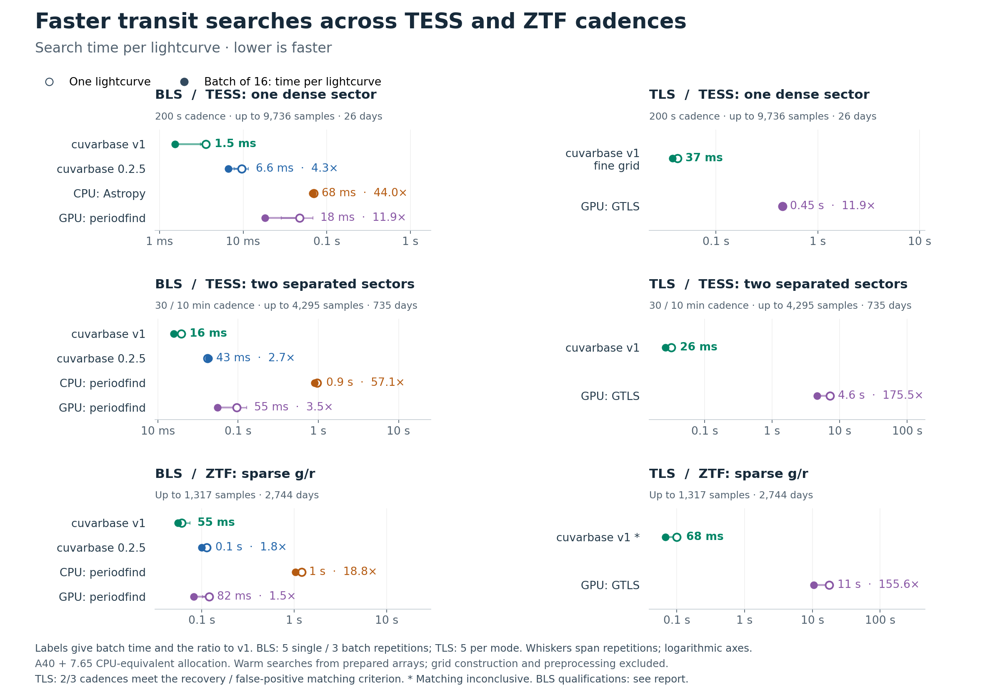

# Transit-search speed and recovery

cuvarbase v1 reduces the work needed for transit searches. BLS batches are **1.8–4.3× faster than PyPI 0.2.5** on these examples; including a fresh native period grid gives **4.2–10.7×**. The separated-TESS upgrade supports its recovery comparison. The larger independent TLS study supports **11.9× and 175.5× faster batches than public GTLS** on the two TESS examples at the stated recovery / false-positive tolerances.

[PDF](figures/transit_benchmarks_20260909.pdf) · [SVG](figures/transit_benchmarks_20260909.svg) · [BLS competitor evidence](../benchmarks/results/transit_2026-09-08/README.md) · [Independent TLS evidence](../benchmarks/results/tls_sensitivity_2026-09-09/README.md)

| Observing pattern | BLS batch: PyPI / v1 time | BLS recovery comparison | TLS batch: GTLS / v1 time | Displayed TLS setting and joint decision |
|---|---:|---|---:|---|
| TESS 200 s | 4.31× | Inconclusive | 11.9× | Fine grid; passes |
| Separated TESS sectors | 2.73× | Supported within 5 pp | 175.5× | Original grid; passes |
| ZTF g/r | 1.82× | Inconclusive | 155.6× | Original grid; matching inconclusive |

**BLS:** 128 calibration nulls, 128 independent injections and 128 test nulls per cadence. The supported comparison requires paired nominal one-sided 95% bounds on recovery loss and false-positive increase below 5 percentage points each. Separated TESS has the same 89/128 detections as PyPI, with a **2.73× batch** or **10.18× fresh-grid-plus-search** upgrade. This is the clearest result for a QLP-oriented migration. Other PyPI comparisons remain timing measurements with unresolved sensitivity bounds.

**TLS:** 4,096 calibration nulls, 2,048 independent injections and 4,096 test nulls per cadence. The frozen rule requires recovery loss below 5 points and the false-positive difference inside ±2 points, using simultaneous confidence bounds across all nine setting/cadence comparisons. Dense TESS passes with the fine grid; all three separated-TESS settings pass. Every setting passes the recovery-loss bound on every cadence. These are bounded results for an equal SNR mixture at a nominal 5% false-alarm target, not exact equality or a per-SNR guarantee.

On ZTF, original-grid v1 detects **1,620/2,048** transits versus **1,546/2,048** for GTLS, and flags **201/4,096** nulls versus **235/4,096**. Its false-positive difference is −0.83 points, with simultaneous bounds **[−2.79, +1.14]**: the lower end misses the strict ±2-point matching rule. This does not demonstrate a sensitivity loss or too many false positives. The rule remains unchanged after seeing the outcomes. GTLS's 12 injection and 32 test-null API failures are retained; the [study](../benchmarks/results/tls_sensitivity_2026-09-09/README.md) explains their handling.

## Where the speed comes from

**BLS reuses work.** v1 shares folded phase histograms across phase offsets, vectorizes host scans and Keplerian-grid construction, and amortizes allocation and dispatch across sources. Disabling histogram fusion makes diagnostic calls 1.35–1.57× slower; grid construction alone is 11–17× faster. Both releases receive warmed kernels and reusable PyPI memory. The component changes are not independent additive savings, and the full upgrade includes selected sampling choices.

**TLS reduces repeated observation-level fitting.** For each trial period, v1 folds observations into weighted phase bins, reuses those bins across transit-shaped template trials and solves depth analytically. Selected candidate periods then receive fits against individual observations. Finer sampling costs time: the figure uses the fine dense-TESS setting that passes the joint study criterion. [Phase binning retains the template shape but approximates its evaluation](TLS_NUMERICS.md); refining candidates does not repair an excluded period or the coarse detection spectrum.

**GTLS has avoidable host overhead as well as different computations.** Batching two Python/CuPy loops improves separate diagnostic runtime by 1.4–8.2×. Those patches are not the public GTLS competitor. The two searches also differ in depth fitting, template sampling and ranking, so their remaining speed ratio cannot be assigned to a single kernel optimization. [Implementation and component comparison](GTLS_COMPARISON.md). cuvarbase's fast TLS architecture predates phase 5; the whole advantage is not a phase-5 gain.

## Workloads, competitors and cost

These are observed cadence examples with synthetic exposure-integrated transits and heteroscedastic white noise plus correlated residuals. Known band baselines and achromatic transits are supplied. Injections must contain at least five in-transit observations and two observed events. The results are conditional recovery tests, not random survey samples, injections into real flux or a complete QLP pipeline benchmark.

The long gap between the two TESS sectors increases the observing baseline and requires much finer period spacing to preserve transit alignment. TLS tests 3,084 periods for dense TESS, 99,043 for separated TESS and 312,064 for ZTF. BLS's earlier grid has a different minimum period; compare within each algorithm family. Single-source latency and 16-source throughput are measured separately, with warm APIs and prepared grids. Actual survey throughput also depends on grid reuse, source diversity, preprocessing and vetting.

Actual PyPI cuvarbase 0.2.5 has no TLS. Astropy, periodfind and fBLS were screened as CPU BLS candidates; periodfind supplies the external GPU comparison. “Strongest tested” refers to successful settings in this campaign, not a universal ranking. Measured BLS batches were 19–57× faster than the tested CPU settings and 1.5–11.9× faster than periodfind GPU; the [BLS report](../benchmarks/results/transit_2026-09-08/README.md) distinguishes supported recovery comparisons.

The A40 bundle costs $0.49/hour. [Search-cost projections](TLS_COST_ANALYSIS.md) use measured throughput and give CPU break-even prices without assuming an unmeasured standalone CPU rental. [The HATPI pilot](../benchmarks/results/tls_sensitivity_2026-09-09/HATPI.md) prices a synthetic high-cadence season; it does not establish real-HATPI detection sensitivity.

The earlier equal-SDE TLS, thousands-fold CPU-TLS and 257–354× Astropy-BLS headlines are retired. The initial 93–284× TLS comparison is superseded by the larger study's settings and timings. The [provenance audit](BENCHMARK_PROVENANCE.md) preserves the original arithmetic and limitations; historical measurement records remain inspectable.
