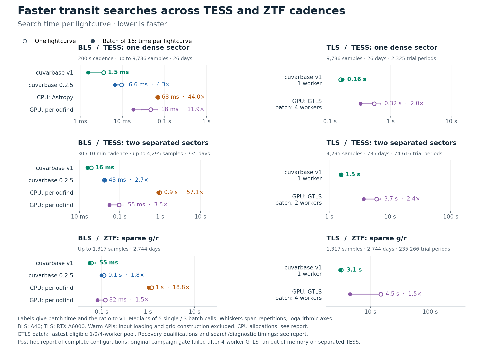

# Transit-search speed and recovery

cuvarbase v1 accelerates transit searches by reusing computation and reducing GPU memory traffic. BLS batches are **1.8–4.3× faster than PyPI 0.2.5** on these workloads. Standard TLS now evaluates individual observations, with GTLS's transit templates and complete refinement; it has no phase-bin cap or separate thin-transit preset.

[PDF](figures/transit_benchmarks_20260910.pdf) · [SVG](figures/transit_benchmarks_20260910.svg) · [BLS evidence](../benchmarks/results/transit_2026-09-08/README.md) · [Current TLS evidence](../benchmarks/results/tls_reference_2026-09-10/README.md)

**TLS is 3.6–4.6× faster for one lightcurve and 1.5–2.4× faster per lightcurve in 16-source batches** than the qualifying GTLS comparisons. All times below are median seconds per lightcurve, including each API's normal output work.

| Cadence | Single v1 / GTLS | Single speedup | Batch v1 / GTLS | Batch speedup | GTLS batch workers |
| --- | ---: | ---: | ---: | ---: | ---: |
| TESS: dense sector | 0.149 / 0.533 s | 3.58× | 0.161 / 0.319 s | 1.98× | 4 |
| TESS: separated sectors | 1.554 / 6.037 s | 3.88× | 1.534 / 3.684 s | 2.40× | 2 |
| ZTF g/r | 3.231 / 14.899 s | 4.61× | 3.116 / 4.545 s | 1.46× | 4 |

The original campaign **failed its all-configurations gate** because four-worker GTLS exhausted GPU memory during the separated-TESS warmup, before any measured repetitions. This report uses a separate, explicitly **post hoc assessment of the 11 completed configurations**, retaining the original numerical checks and fastest-eligible-pool rule. The original failure is preserved; failed or incomplete calls never supply a speed denominator. [Original gate](../benchmarks/results/tls_reference_2026-09-10/timing/acceptance.json) · [Reporting assessment](../benchmarks/results/tls_reference_2026-09-10/reporting_acceptance.json).

The hollow markers give single-lightcurve latency. Filled markers give the elapsed time for 16 sources divided by 16. TLS compares one cuvarbase worker with the fastest tested GTLS pool that preserves its frozen search outputs; the archive retains every tested pool. TLS times include each API's normal output work; separate measurements below end at final search-window selection, before GTLS's extra diagnostics. Ratios compare median elapsed times within an algorithm family. BLS and TLS use their respective recorded period domains; the figure does not rank them at identical sensitivity.

## Sensitivity and thin transits

The new TLS comparison tests an implementation of GTLS's observation-level numerical search. It checks complete residual and power spectra, masks, candidate/harmonic ranks, refinements and final selections. Exact differential agreement uses GTLS with a disclosed host-mask correction; untouched GTLS outcomes are retained separately. Equal scalar SDE alone would not establish this agreement.

**All 160 main independent cases and all 24 separately sealed supplementary nulls match corrected GTLS numerically**, with no API failures. Untouched GTLS is also exactly equal in 151 of the 160 main cases and all 24 supplementary cases; the nine mask-defect differences leave the selected period, injected-signal recovery and the SDE > 8 decisions unchanged. Together, the 96 injection outcomes and 88 null decisions agree with both native variants at that threshold. The supplementary population remains separately reported; it does not enlarge the main study after the fact. The archive retains every comparison and the separately recorded native correction.

A fixed SDE of 8 is **not** a calibrated survey false-alarm threshold: all eight ordinary-ZTF nulls and four of eight separated-TESS nulls exceed it, versus none of the dense-TESS nulls. Numerical equivalence establishes agreement between the engines on these inputs; it does not make this threshold appropriate for every cadence. The per-regime outcome tables are in the [validation evidence](../benchmarks/results/tls_reference_2026-09-10/validation/README.md).

The independent population contains 96 injected transits and 64 noise-only curves across eight regimes: ordinary, high-impact, eccentric and dense-M-dwarf TESS; ordinary, high-impact and dense-M-dwarf ZTF; and separated TESS sectors. Each regime includes three injections at each white-noise oracle SNR of 6, 8, 10 and 12, plus eight nulls. These SNR labels exclude the additional correlated noise and differ from each package's reported statistics. The full-grid searches never insert the injected period. Observed cadences receive exposure-integrated physical transits, heteroscedastic Gaussian noise and correlated residuals. Band offsets are assumed removed; injected transit depths are achromatic. The searches receive time, flux and uncertainty arrays rather than a joint multiband model. Signals must have at least five in-transit observations and two sampled events; these are conditional examples, not random survey draws or injections into real flux. Recovery rates use paired successful searches; the archive lists planned cases and failures alongside them.

Separate numerical stress tests include grazing transits, phase wrap/ties, large absolute epochs, heteroscedasticity and long periods. At a 365-day period, both a roughly 8-hour solar-host transit and a 1.7-hour M-dwarf transit matched GTLS through complete spectra, refinement and final fitting. The latter has duration/period about **0.000197**. Those two tests use 77,888 observations from repeated TESS campaigns and a selected period grid containing the truth. Both engines refine the true period and admissible widths, but both choose an alias or unrelated period in these noisy fixtures. They establish numerical agreement, not positive recovery or annual-period survey throughput; the stress archive retains those misses.

The stronger fixed-noise M-dwarf control recovers the annual-period fundamental within the predeclared half-duration drift limit. The stronger solar control selects a one-third-period alias in all three methods. Its original final results match, but one intermediate coarse residual differs; the original strict comparison remains failed. A separate repeated-run diagnostic reproduced that difference by changing only the float32 flux cumulative sums. GTLS itself varies across identical runs, sometimes changing depth gates, masks and final SDE. Both fitting kernels give bitwise-identical scores and winners on identical saved intermediate arrays. All nine repeats select the same alias and final fit; the true annual period is tied for the minimum residual. These are shared numerical and alias limits, not an omitted thin-transit template. The [diagnostic](../benchmarks/results/tls_reference_2026-09-10/stress/diagnostic/README.md) retains the complete evidence.

There is no extra phase-binning loss in the default. The shared numerical model still uses GTLS's sample-window/template approximation and a finite search domain. Small validation cohorts cannot measure population completeness to one or two percentage points; neither code can detect an unsampled transit or overcome arbitrary noise.

For BLS, the September 8 study has 128 calibration nulls, 128 independent injections and 128 test nulls per cadence. The separated-TESS upgrade has the same **89/128** detections as PyPI and supports a recovery loss and false-positive increase below five percentage points under the paired nominal one-sided 95% bounds. It is **2.73× faster in batches**, or **10.18× including a fresh grid**. The other PyPI comparisons remain timing measurements with inconclusive sensitivity bounds. The BLS archive gives the external-competitor qualifications. A [source audit](validation/tls-default-20260910/bls-source-continuity.json) confirms that the measured BLS implementation and its local dependencies are unchanged except for one documentation link; these dated measurements are reused, not rerun.

## Where the speed comes from

**BLS reuses folded phase histograms across phase offsets.** Disabling histogram fusion made diagnostic calls 1.35–1.57× slower. Vectorized host scans and Keplerian-grid construction remove Python loops; grid construction alone was 11–17× faster. Batch APIs amortize allocation and dispatch. These effects overlap and cannot be added. Both releases receive warmed kernels and reusable PyPI memory.

**TLS retains observations and removes repeated work.** Fused kernels reuse residual calculations and reduce winning trials on the GPU instead of storing the full duration-by-epoch residual tensor. Reusable CUDA graphs replay native row-wise cumulative sums without thousands of separate Python dispatches. Physical workspaces are bounded while preserving logical duration groups. An ordinary matrix-axis cumulative sum changes floating-point rounding and threshold decisions, so it is not substituted for the native flux scan.

The separate component measurements use five complete calls per implementation and cadence:

| Cadence | cuvarbase common search | GTLS common search | Search speedup | GTLS work after search |
| --- | ---: | ---: | ---: | ---: |
| TESS: dense sector | 0.167 s | 0.463 s | 2.77× | 0.110 s |
| TESS: separated sectors | 1.563 s | 6.249 s | 4.00× | 0.076 s |
| ZTF g/r | 3.086 s | 16.181 s | 5.24× | 0.313 s |

cuvarbase's own work after the search took 2.5 ms, 7.2 ms and 70.7 ms, respectively. In dense TESS, GTLS's nested SNR/pink-noise diagnostics took about 103 ms, contributing to the full-API ratio beyond the 2.77× search improvement. The longer-baseline wins chiefly come from search computation. Stage medians are computed separately; inclusive and nested stages must not be added. These measurements separate the combined search improvement from output work; they do not isolate the contributions of CUDA graphs and fused kernels.

GTLS's full public API also computes extra CPU SNR and pink-noise diagnostics. The separate component experiment ends the common search clock after final window selection and reports subsequent output work separately. The public figure includes each API's normal output work. Neither omitted diagnostics nor the invalid-candidate correction is described as a faster fitting kernel. [Detailed implementation comparison](GTLS_COMPARISON.md).

## Timing boundary, competitors and cost

The BLS campaign used an NVIDIA A40. The new TLS timing campaign uses an NVIDIA RTX A6000, with both TLS implementations on that same machine. The A6000 was selected for availability after A40 allocation requests failed, before any timing results were observed. Both timing campaigns have a 7.65-CPU quota on Xeon Gold 6342 hosts, in separate rentals. TLS limits each worker's numerical libraries to one thread. Host-visible logical CPU counts are not the allocation. Software and actual hardware receipts are retained. Ratios compare implementations on the same device within each algorithm; the figure does not compare BLS with TLS on common hardware. Timings use warm APIs, five single calls and three batches of 16 sources. GTLS pools of one, two and four workers are tested; every timed search must retain its own frozen reference outputs. Input loading and explicit period-grid generation are excluded. TLS includes construction, validation, template preparation, the coarse search, complete candidate/harmonic refinement and final fitting. BLS's earlier prepared-array boundary and separate fresh-grid experiment are documented in its archive.

The TLS grids contain 2,325 periods for dense TESS, 74,616 for separated TESS and 235,266 for ordinary ZTF. Gaps increase the baseline and therefore the period resolution needed to preserve transit alignment. Dense-M-dwarf ZTF validation uses 1,093,617 periods. cuvarbase and GTLS receive identical arrays and grids within every comparison.

TLS repeats one predeclared noise-only lightcurve per cadence five times and the predeclared 16-source null cohort three times. Single calls use one worker per implementation; batch comparisons test one, two and four GTLS workers against the standard cuvarbase batch. Repetitions measure variability on these fixed inputs, not a random survey population. Every search included in the reported timings must reproduce its own frozen study outputs. The 184-case sensitivity validation uses the single-worker reference; GTLS pools qualify by reproducing the frozen outputs on the 16-source timing cohort. Those batch repetitions are not an additional injection/recovery study. Failed calls and ineligible pools remain in the evidence and never serve as successful timing denominators. Selection follows the predeclared API-success rule.

Actual PyPI cuvarbase 0.2.5 has no TLS. Astropy, periodfind and fBLS were screened as CPU BLS candidates; periodfind supplies the external GPU comparison. “Strongest tested” refers to successful settings in this campaign. Measured BLS batches were 19–57× faster than those CPU settings and 1.5–11.9× faster than periodfind GPU, with recovery qualifications in the BLS archive.

[Compute-cost calculations](TLS_COST_ANALYSIS.md) use the recorded $0.49/hour A40 bundle for BLS and $0.53/hour RTX A6000 bundle for TLS. Both cost tables project the measured 16-source throughput; they are not measured million-source jobs. They exclude I/O, preprocessing, idle time and vetting. The previous synthetic HATPI pilot measured the older binned engine; its cost and speed ratios do not price the new default or establish real-HATPI recovery.

The earlier 93–284× TLS comparison and the subsequent 11.9–175.5× study measured the phase-binned engine against GTLS fast mode. They remain [dated evidence](../benchmarks/results/tls_sensitivity_2026-09-09/README.md), alongside the [provenance audit](BENCHMARK_PROVENANCE.md). They are superseded as default-engine headlines by this full-search comparison.
