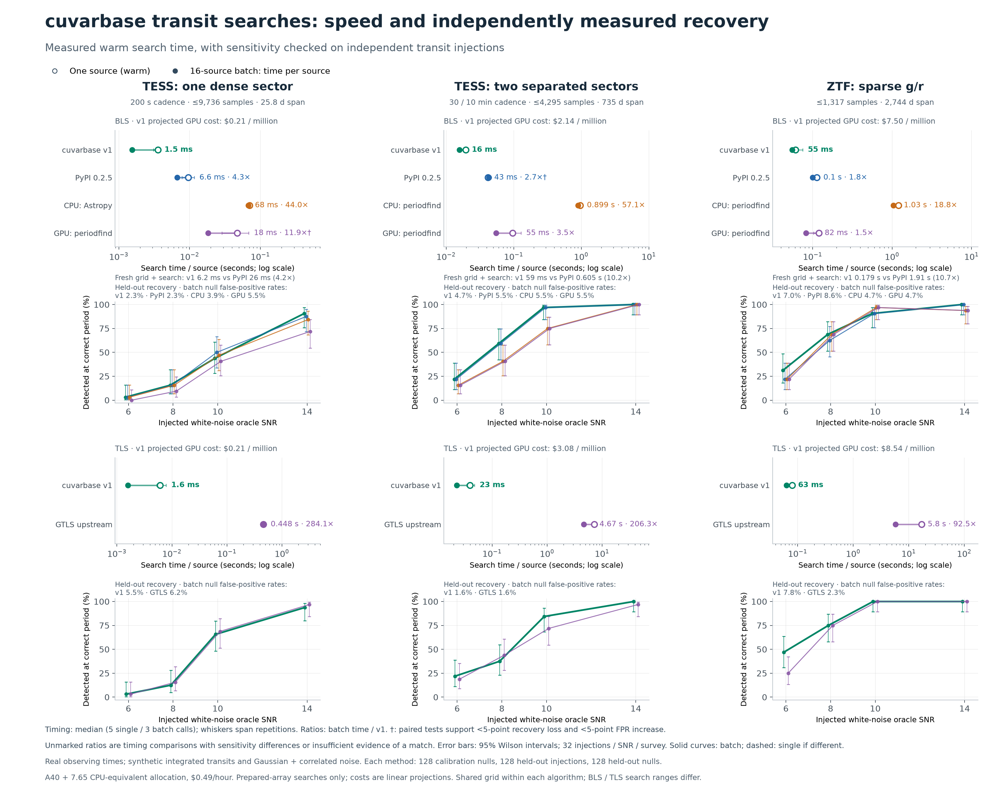

# Transit searches: measured speed and recovery

cuvarbase v1 reduces the cost of the transit-search stage. This experiment compares actual PyPI BLS, external CPU/GPU BLS, and GTLS using observed ZTF and TESS cadences with independent synthetic transit injections. It measures both one-source latency and throughput for 16 distinct sources.

For a fresh native Keplerian grid plus BLS search, v1 is **4.2–10.7× faster than PyPI 0.2.5** on these three examples. The separated-sector TESS result supports the reported 5-point detection/false-positive criterion; the other PyPI comparisons remain inconclusive. TLS batch search time is **92.5–284.1× lower than public GTLS**, but **equivalent TLS detection sensitivity is not established** by this experiment.

[PDF figure](figures/transit_benchmarks_20260908.pdf) · [SVG figure](figures/transit_benchmarks_20260908.svg) · [Full experiment and evidence](../benchmarks/results/transit_2026-09-08/README.md)

| Observing pattern | BLS batch: PyPI / v1 time | BLS recovery match | TLS batch: GTLS / v1 time | TLS recovery match |
|---|---:|---|---:|---|
| TESS 200 s | 4.31× | Not established | 284.14× | Not established |
| Separated TESS sectors | 2.73× | Supported within 5 pp | 206.32× | Not established |
| ZTF g/r | 1.82× | Not established | 92.51× | Not established |

“Supported” uses paired, nominal one-sided 95% bounds: detection-recovery loss below 5 percentage points and false-positive increase below 5 points. An unresolved comparison remains a timing observation. Native SDE values are not evidence of equivalent sensitivity. Each method has 128 independent calibration nulls, 128 held-out injections and 128 held-out nulls per cadence.

BLS gains come from fused phase histograms, vectorized host scans and grid construction, and amortizing work across a batch. Disabling fusion increases diagnostic API time by 1.35–1.57×; observation scattering does not demonstrate a benefit on these cases. Both releases receive warmed kernels and reusable PyPI memory. TLS combines a phase-binned search and exact refinement of selected candidates with fewer Python-to-GPU dispatches. Batching two GTLS host loops improves its diagnostic runtime by 1.4–8.2×. GTLS and cuvarbase are related template searches with different numerical objectives, sampling and refinement. The remaining speed gap is not a comparison of identical computations. Full component evidence is retained in the report; not every gain is a phase-5 change.

The A40 bundle costs $0.49/hour. [Search-cost estimates](TLS_COST_ANALYSIS.md) are linear projections of measured search throughput, excluding preprocessing, imports, I/O, idle time and candidate vetting. The full report gives CPU-only break-even prices rather than assuming an unmeasured CPU rental price. The tests use real observing times with controlled flux/noise, known band baselines and observable injected transits; they are not a catalog completeness estimate or a complete QLP pipeline benchmark.

The period grid and density prior follow the published [QLP search description](https://arxiv.org/abs/2302.01293), with a separate tuning stage. Actual PyPI cuvarbase 0.2.5 has no TLS implementation, so its upgrade comparison is BLS only. Astropy, periodfind and fBLS were screened as external CPU BLS candidates; periodfind supplies the external GPU BLS comparison. “Best” means the strongest successfully tested setting in this campaign, not a universal ranking.

The earlier 30–171× equal-SDE TLS headline, thousands-fold CPU-TLS claim, and 257–354× Astropy-BLS headline are superseded as release advertising by this report. The [provenance audit](BENCHMARK_PROVENANCE.md) explains their original arithmetic and limitations; historical measurements remain available for inspection.

## What would establish comparable TLS sensitivity?

The current test does not establish the specified recovery and false-positive margins. Dense TESS recovered 56/128 injections with v1 versus 59/128 with GTLS; its confidence bound still permits an 8.7-point recovery loss. Separated TESS recovered 78/128 versus 74/128, but its lower confidence bound narrowly misses the allowed 5-point loss. ZTF recovered 103/128 versus 96/128 while flagging 10/128 held-out nulls versus 3/128. More detections at a higher false-positive rate do not establish equal sensitivity.

A follow-up needs a predeclared false-positive target and recovery tolerance, a separate tuning/calibration set, and a larger independent test population sized for those tolerances. Compare recovery at that common false-positive target, including weak signals and the cadence/duration regimes of interest. Tune both implementations fairly, freeze settings before the final test, and measure the runtime of the settings that meet the criterion. Finer cuvarbase sampling may reduce its speed advantage; additional data alone cannot guarantee a pass. A successful result would support a bounded, workload-specific recovery claim, rather than exact algorithmic equivalence.
