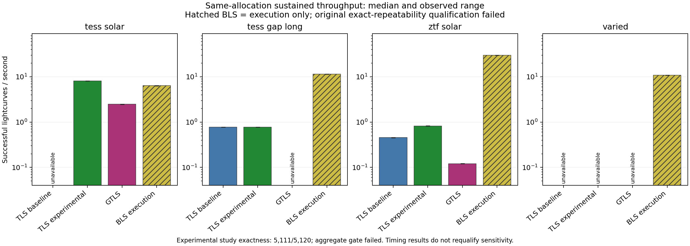
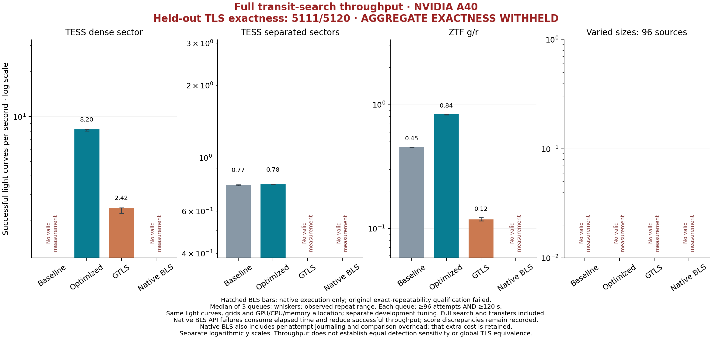

# Transit-search recovery and throughput

The completed science report finds a TLS detection advantage in four TESS populations, a severe grazing/smearing vulnerability and a failed aggregate implementation-exactness gate. This is the native GTLS-compatible observation-level search, not a reproduction of canonical CPU TLS. The release retains baseline execution by default and requires an experimental selector for the measured optimization bundle. [Numerical contract](TLS_NUMERICS.md) · [GTLS/CPU differences](GTLS_COMPARISON.md) · [Published evidence](TLS_LITERATURE.md).

[Collected recovery report](../benchmarks/results/tls_survey_2026-09-10/final-report/RECOVERY.md) · [report provenance](BENCHMARK_ARCHIVES.md#tls_survey_2026-09-10 "Archived file: benchmarks/results/tls_survey_2026-09-10/final-report/provenance.json") · [held-out expected-SNR receipt](BENCHMARK_ARCHIVES.md#tls_survey_2026-09-10 "Archived file: benchmarks/results/tls_survey_2026-09-10/final-science/heldout-snr-final.json") · [original exactness receipt](BENCHMARK_ARCHIVES.md#tls_survey_2026-09-10 "Archived file: benchmarks/results/tls_survey_2026-09-10/final-science/exactness-final.json"). The completed collection preserves the reviewed detection, expected-response and original mismatch receipts unchanged. **Sustained timing, release validation, collection and rental teardown are complete; failed timing panels remain unavailable.** Earlier September 8–10 speed figures retain their historical source/workload scopes and do not supply missing bars or denominators for the new sustained study.

The [September 24 follow-up](../benchmarks/results/tls_survey_2026-09-10/throughput-followup-20260924/REPORT.md) is complete, with 11 of 16 reportable timing panels. Native BLS execution retains its numerical discrepancies; the TLS/GTLS panels use their original strict gates. Five panels remain unavailable after repeatability or memory failures. The expanded GPU suite passed 2,091 tests with one expected failure and zero skips. A separate gate initially failed because its launcher could not import the package; the [September 27 installed-wheel check](../benchmarks/results/tls_survey_2026-09-10/release-gate-20260927/README.md) passed all 14 additional checks and six dependency preflights. Both rentals were terminated after verified collection, and their evidence passed R2 checksum read-back. The original study and its failed qualifications remain unchanged.

## Blind recovery by regime

Each regime contains 256 injections, 256 independent test nulls and 512 independently generated calibration nulls. TLS and BLS share the same paired input banks and full period arrays. BLS duration/epoch settings and its ranking statistic were selected on development data before the seal; the comparison uses the strongest development-selected control, not an ideal-box oracle. No threshold or detector setting was retuned on held-out outcomes.

A detection requires strict threshold exceedance and a selected-period drift across the baseline no larger than half the physical contact duration. Aliases are separately descriptive. Unsampled/few-event signals remain in the denominator; all planned TLS/BLS injection and test-null executions completed validly.

Both tables show the original rates and simultaneous paired TLS-minus-BLS intervals in percentage points. The predeclared Bonferroni family covers 40 recovery/FPR contrasts across ten regimes and two operating points (at least 95% simultaneous coverage). These are not pooled rates or newly calculated intervals.

### 5% calibrated target

| Regime | TLS recovery | BLS recovery | TLS − BLS, pp [simultaneous interval] |
| --- | ---: | ---: | ---: |
| TESS solar | 73/256 (28.52%) | 40/256 (15.62%) | +12.89 [+1.37, +23.50] |
| TESS high impact | 128/256 (50.00%) | 53/256 (20.70%) | +29.30 [+17.05, +39.77] |
| TESS eccentric | 83/256 (32.42%) | 28/256 (10.94%) | +21.48 [+9.34, +32.15] |
| TESS M dwarf | 154/256 (60.16%) | 60/256 (23.44%) | +36.72 [+23.67, +47.52] |
| ZTF solar | 183/256 (71.48%) | 197/256 (76.95%) | -5.47 [-13.55, +3.03] |
| ZTF high impact | 147/256 (57.42%) | 159/256 (62.11%) | -4.69 [-15.71, +6.67] |
| ZTF M dwarf | 103/256 (40.23%) | 124/256 (48.44%) | -8.20 [-20.98, +5.14] |
| TESS long gap | 40/256 (15.62%) | 59/256 (23.05%) | -7.42 [-16.50, +2.21] |
| TESS grazing/smeared | 1/256 (0.39%) | 109/256 (42.58%) | -42.19 [-53.06, -28.72] |
| Synthetic HATpi short | 3/256 (1.17%) | 0/256 (0.00%) | +1.17 [-3.05, +5.55] |

### 1% calibrated target

| Regime | TLS recovery | BLS recovery | TLS − BLS, pp [simultaneous interval] |
| --- | ---: | ---: | ---: |
| TESS solar | 53/256 (20.70%) | 19/256 (7.42%) | +13.28 [+1.67, +23.95] |
| TESS high impact | 112/256 (43.75%) | 33/256 (12.89%) | +30.86 [+18.42, +41.43] |
| TESS eccentric | 73/256 (28.52%) | 6/256 (2.34%) | +26.17 [+13.30, +37.26] |
| TESS M dwarf | 144/256 (56.25%) | 37/256 (14.45%) | +41.80 [+28.35, +52.67] |
| ZTF solar | 176/256 (68.75%) | 192/256 (75.00%) | -6.25 [-14.10, +2.07] |
| ZTF high impact | 131/256 (51.17%) | 156/256 (60.94%) | -9.77 [-20.76, +1.92] |
| ZTF M dwarf | 98/256 (38.28%) | 122/256 (47.66%) | -9.38 [-22.35, +4.24] |
| TESS long gap | 23/256 (8.98%) | 47/256 (18.36%) | -9.38 [-18.52, +0.46] |
| TESS grazing/smeared | 0/256 (0.00%) | 97/256 (37.89%) | -37.89 [-48.72, -24.74] |
| Synthetic HATpi short | 0/256 (0.00%) | 0/256 (0.00%) | +0.00 [-3.10, +3.10] |

Four TESS gains and the grazing/smearing deficit exclude zero at both targets in those simultaneous intervals. ZTF and long-gap TESS favor BLS in point estimates, but their simultaneous intervals cross zero. More favorable marginal contrasts remain in the full report and do not replace this simultaneous interpretation. Both methods recover very few synthetic-HATpi signals. At assigned target SNR 12, primary grazing recovery is still 0/64 versus 36/64; assigned levels are not realized/package SNR values.

## Calibrated targets and realized false positives

The 5% and 1% labels are common calibrated target FPRs, not proven equal realized rates. Each method gets a separate threshold from the same paired calibration bank, independently of development and the test banks. Null noise-scale labels are IID draws from the equal four-level mixture; injection labels are balanced for subgroup precision.

With 512 calibration scores, strict exceedance of ascending ranks 488 and 508 gives no-tie marginal bounds 25/513 = 4.8733% and 5/513 = 0.9747%. Ties can only make the strict rule more conservative; this calibration had no additional conservatism at the selected cuts. The guarantee is marginal over calibration draws under exchangeability, not a guarantee for the conditional FPR of this particular threshold.

Observed test FPRs span 1.56–7.81% at the primary target and 0–2.73% at the secondary target. For grazing/smeared cases at 5%, TLS has 11/256 false positives (4.30%, marginal 95% interval 2.16–7.56%) and BLS 12/256 (4.69%, 2.45–8.04%). All paired simultaneous FPR intervals include zero; their width does not prove equal FPRs. Zero false positives in 256 still has a two-sided 95% upper bound near 1.43%. One outcome changes a regime rate by 0.390625 percentage points, so this study cannot establish 0.1-percentage-point noninferiority.

## Comparable expected signal response

At the known period, the native cached-template family and an ideal box use the same sampled noiseless signal, inverse-variance weights and fitted constant. White responses are ceilings for the enumerated families under the diagonal-error objective. OU values evaluate those same white-selected filters with the declared correlated-noise covariance; they are not independently OU-optimal maxima. All blind populations include heterogeneous errors and the OU component, so these white columns are not a separate white-noise recovery trial. These ratios are neither package SNR/SDE nor the selected blind BLS output.

| Regime | Finite / 256 | White median advantage | OU median advantage |
| --- | ---: | ---: | ---: |
| TESS solar | 256/256 | +0.951% | +0.927% |
| TESS high impact | 256/256 | +0.978% | +0.471% |
| TESS eccentric | 256/256 | +0.903% | +0.663% |
| TESS M dwarf | 256/256 | +1.359% | +0.890% |
| ZTF solar | 254/256 | +0.589% | +0.580% |
| ZTF high impact | 256/256 | +0.166% | +0.179% |
| ZTF M dwarf | 256/256 | +0.348% | +0.308% |
| TESS long gap | 255/256 | +0.953% | +0.445% |
| TESS grazing/smeared | 256/256 | +0.936% | +0.708% |
| Synthetic HATpi short | 246/256 | +0.904% | +0.333% |

Medians are descriptive, not confidence intervals. Median white advantages of +0.166% to +1.359% coexist with large blind-recovery gains in four TESS regimes: the actual detection advantage is not inferred to be only about 1%. Conversely, available family response need not be attained by native admission, fitting, candidate competition or ranking.

Negative tails matter. Observed minimum white family/box differences reach −51.353% in ZTF high impact, −37.484% in ZTF M dwarfs and −44.885% in long-gap TESS; their OU counterparts are −51.518%, −37.868% and −50.768%. These occur in the primary TLS-missed groups and are observed extrema, not confidence limits or a causal explanation of every miss. All ten regimes contain a negative OU difference. Undefined ratios are excluded only from descriptive ratios, never from recovery denominators.

Grazing/smearing has a +0.936% median white family/box advantage despite only 1/256 primary detections. That ceiling does not quantify the actually admitted/scored filter or prove a specific native-gate mechanism. Ratios to the ideal box alone do not measure either filter's retained fraction of physical-oracle SNR. The eight-case development float64 window analysis did not reproduce actual GPU prefix/gate decisions; no held-out gate tracing was performed.

## Exactness, approximation policy and coverage

The operative approximation allowances were frozen at **zero**. Original baseline/candidate comparisons give **5,111/5,120 exact pairs and nine chi2/SDE mismatches**, with no changed selected period or either frozen-threshold decision. The aggregate zero-mismatch gate failed; repeats never replace failures. The baseline pass reuses candidate cuts and does not independently calibrate the baseline. All 512 grazing implementation pairs matched, so that observed detector deficit also occurs in the retained baseline under those cuts. No baseline-gate causation is established.

Coverage is finite: fixed observed TESS/ZTF cadences and synthetic HATpi-like cadence, two stellar-density points including small M dwarfs, high-impact/eccentric/grazing configurations, thin ingress, exposure smearing, gaps, aliases, heterogeneous errors, OU noise and few/unsampled events. The grazing regime has 1,800-second exposures throughout. Earth-size planets, fixed limb darkening and eccentric orientation ω=90° limit transport to other systems. Main ZTF injections cover 2–6 days; broader/joint-extreme boundary diagnostics are not additional blind-recovery populations. Rescaled ZTF errors make this a controlled sampling/algorithm experiment, not a predicted Earth-size ZTF survey yield. No universal equivalence or recovery outside represented subgroups is established.

## Sustained single-GPU throughput

### September 24–25 follow-up

[Full report and observed ranges](../benchmarks/results/tls_survey_2026-09-10/throughput-followup-20260924/REPORT.md) · [exact CSV](../benchmarks/results/tls_survey_2026-09-10/throughput-followup-20260924/measurements.csv) · [failure review](../benchmarks/results/tls_survey_2026-09-10/throughput-followup-20260924/REVIEW.md) · [provenance](BENCHMARK_ARCHIVES.md#tls_survey_2026-09-10 "Archived file: benchmarks/results/tls_survey_2026-09-10/throughput-followup-20260924/review.json").

These median rates are successful light curves per second on one A40 allocation at $0.49/hour. Each available panel contains three complete queues, each lasting at least 120 seconds with at least 96 attempts. Inputs, full period grids and numerical sources retain their frozen definitions.

| Workload | Baseline TLS | Experimental TLS | Public GTLS | BLS execution only |
| --- | ---: | ---: | ---: | ---: |
| TESS solar | unavailable | 8.0722 | 2.4760 | 6.3618 |
| TESS long gap | 0.77039 | 0.77554 | unavailable | 11.4446 |
| ZTF solar | 0.45455 | 0.82349 | 0.12111 | 29.8506 |
| Varied | unavailable | unavailable | unavailable | 10.8464 |

Seven TLS/GTLS panels passed their strict timing qualifications. Four BLS panels report execution speed under the separately declared contract: all 21,232 measured calls completed without API failures, but 1,654 selected-output discrepancies across queues and diagnostics remain recorded. Those BLS rates confer no numerical qualification. Repeated calls are not independent scientific populations.

The experimental/baseline median ratios are **1.812×** for ZTF solar and **1.007×** for long-gap TESS, where the paired complete-spectrum timing checks passed. Baseline TESS solar and both TLS varied panels failed repeatability checks. GTLS long-gap ran out of memory; GTLS varied had both repeatability and memory failures. All five remain unavailable. No failed experiment was rerun to replace its outcome, and the original **5,111/5,120** aggregate exactness gate remains failed.

The benchmark rental and the separate installed-wheel release check are terminated, with checksum-verified local collection and R2 read-back. Their estimated compute costs were $2.8053 and $0.0373. The [current conservative ledger](BENCHMARK_ARCHIVES.md#tls_survey_2026-09-10 "Archived file: benchmarks/results/tls_survey_2026-09-10/release-gate-20260927/summary.json"), including prior allocations and retained storage reserves, is **$78.1846** within the authorized $100. These are estimates and reserves, not provider invoices.

### Original September 10–12 allocation

The original allocation below remains dated evidence. Its settings, rates, exclusions and ledger are separate from the follow-up above.

[PDF](BENCHMARK_ARCHIVES.md#tls_survey_2026-09-10 "Archived file: benchmarks/results/tls_survey_2026-09-10/final-figures/survey-throughput-with-native-bls.pdf") · [SVG](BENCHMARK_ARCHIVES.md#tls_survey_2026-09-10 "Archived file: benchmarks/results/tls_survey_2026-09-10/final-figures/survey-throughput-with-native-bls.svg") · [exact CSV](../benchmarks/results/tls_survey_2026-09-10/final-figures/survey-throughput-with-native-bls.csv) · [renderer provenance](BENCHMARK_ARCHIVES.md#tls_survey_2026-09-10 "Archived file: benchmarks/results/tls_survey_2026-09-10/final-figures/survey-throughput-with-native-bls.data.json"). The frozen figure label “Optimized” means the opt-in experimental candidate, not the release default.

| Workload | Engine | Workers / batch | Median light curves/s | Observed repetition range |
| --- | --- | ---: | ---: | ---: |
| TESS solar | Experimental TLS | 4 / 4 | 8.203064 | 8.039095–8.209117 |
| TESS solar | Public GTLS | 2 / 1 | 2.424906 | 2.254147–2.443050 |
| TESS long gap | Baseline TLS | 4 / 8 | 0.770469 | 0.766306–0.773155 |
| TESS long gap | Experimental TLS | 4 / 4 | 0.775998 | 0.774032–0.776135 |
| ZTF solar | Baseline TLS | 4 / 8 | 0.452633 | 0.451925–0.455362 |
| ZTF solar | Experimental TLS | 4 / 4 | 0.837289 | 0.826802–0.838994 |
| ZTF solar | Public GTLS | 2 / 1 | 0.118107 | 0.115367–0.122672 |

Each rate has three whole-cohort queue repetitions of at least 96 calls and 120 seconds. The shared allocation was one A40, 7.65 CPU cores, 49,999,998,976 bytes of host RAM and $0.49/hour compute. Each backend independently tested workers 1/2/4 at batch 1, then batches 4/8 at the eligible winning worker count. This conditional search does not establish a global tuning optimum. Repetition ranges describe the three observed measurements, not inferential confidence intervals. Ordinary panels repeat 16 fresh null inputs; the varied panel uses 96 distinct deterministically masked null inputs and has no qualifying rate.

The collected campaign has seven eligible engine/workload rates. The experimental candidate reaches a median 0.837289 light curves/s on ZTF solar versus baseline 0.452633, a **1.850×** ratio; long-gap TESS is 0.775998 versus 0.770469, **1.007×**. Both timing-cohort gates and the unchanged paired spectrum check passed in those two regimes. Baseline dense TESS and all varied-size panels remain excluded, so they supply no baseline/candidate ratio. These timings do not override the failed 5,111/5,120 aggregate gate. [Final rates, ranges and exclusions](../benchmarks/results/tls_survey_2026-09-10/final-timing/reporting/TIMING_LINKED.md) · [figure and value provenance](BENCHMARK_ARCHIVES.md#tls_survey_2026-09-10 "Archived file: benchmarks/results/tls_survey_2026-09-10/final-figures/survey-throughput-with-native-bls.data.json").

Seven of sixteen backend/panel bars are available. Baseline dense TESS failed post-queue required-output qualification after three queues; baseline varied failed pre-queue qualification; the experimental varied one-worker reference failed its post-queue gate before the selected pool ran. Public GTLS long-gap and varied failed with out-of-memory errors in their first queues. The original BLS trial failed selected-output repeatability; its execution supplement separately failed launcher/allocation checks because two required thread-limit variables were unset. All three supplemental worker-count pilots stopped before worker creation, leaving four explicitly unavailable measurement panels. No failed queue or reference supplies a passing speed denominator. [Full exclusions and native BLS launch audit](BENCHMARK_ARCHIVES.md#tls_survey_2026-09-10 "Archived file: benchmarks/results/tls_survey_2026-09-10/final-timing/reporting/native-bls-launch-audit.json").

Queue wall time includes dispatch, public API validation, template work, transfers, search/refinement, result construction and scalar checks. Input loading, imports/context setup, first-cohort full-output checks and exact grid regeneration are recorded separately and included in cold amortization. Existing filesystem/compiler caches were retained; “cold” is a first complete cohort with setup, not single-lightcurve latency. On ZTF, cold first-cohort time was 149.757 seconds baseline and 85.627 experimental, with sampled GPU peaks 2.610/2.526 GB and worker RSS peaks 2.114/1.746 GB. Sampled memory is a lower bound, and GB here is decimal.

Projected ZTF steady compute cost is $300.71 versus $162.56 per million calls, using the median repetition rates; cold-amortized projections are $371.04 versus $197.83 using total calls and summed queue elapsed plus preparation. No million-call run is claimed. Acquisition, detrending and vetting are outside this boundary. All seven rows’ cold, cost and memory values and the original cost-prose erratum are in the [collected timing note](../benchmarks/results/tls_survey_2026-09-10/final-timing/reporting/TIMING_LINKED.md) and [verification receipt](BENCHMARK_ARCHIVES.md#tls_survey_2026-09-10 "Archived file: benchmarks/results/tls_survey_2026-09-10/final-timing/reporting/timing-verification.json"). The short-row dispatch was active for all four experimental ZTF workers with zero recorded fallbacks; both TESS panels used the shape fallback. These measurements do not isolate each optimization’s causal contribution.

The [original allocation's final ledger](BENCHMARK_ARCHIVES.md#tls_survey_2026-09-10 "Archived file: benchmarks/results/tls_survey_2026-09-10/collection/final-ledger.json") estimates **$71.8522** for observed rentals including elapsed storage. Its conservative total was **$73.7563**, including full storage reserves and a retained $1.50 reserve for the rejected 80 GB request. All actual rentals and owned monitoring processes from that allocation were closed; final provider queries listed no pods. These are estimates and reserves, not provider invoices. The [original rental ledger](BENCHMARK_ARCHIVES.md#tls_survey_2026-09-10 "Archived file: benchmarks/results/tls_survey_2026-09-10/collection/original-rental-closed-ledger.json") remains separately preserved; the current cumulative estimate appears above.

## Release validation

The September 24–25 full A40 suite passed **2,091 tests**, with one expected notebook failure, no unexpected failures and zero skips. The separate gate launcher failed to import the package before running its checks. The [September 27 installed-wheel gate](../benchmarks/results/tls_survey_2026-09-10/release-gate-20260927/README.md) then passed all **14 numerical/runtime checks and six dependency preflights**, with all 86 installed package files matching the previously built wheel byte for byte. The original failed launcher receipt remains preserved. Both sets of evidence have verified R2 backups; this operational correction changes no numerical source or benchmark qualification.

The earlier [release-wiring validation](../benchmarks/results/tls_survey_2026-09-10/release-validation/README.md) passed all 24 paired numerical comparisons and 86 device tests on eleven fixed development inputs. This checks release wiring; it does not requalify experimental sensitivity. The fixed run completed in **177.83 seconds** within its 900-second cap, with normal child teardown and an empty GPU. It also exercised scalar/convenience, batch and permutation-FAP routing, separate backend caches, short-kernel dispatch and native graph fallback.

The separate A40 used Python 3.11.10, NVCC 12.4.131 and all 64 pinned dependency versions, with the same 7.65-CPU quota and RAM limit. Its GPU UUID and driver differed (570.211.01 versus 570.195.03), and its temporary disk was 20 GB. These checks supply no new throughput or population-sensitivity result. Earlier host validation passed 872 tests, with 18 skips, 1,117 deselections and one existing xfail; 219 focused checks also passed from the verified wheel. All installation and test receipts, including the first failed PyCUDA build before NumPy was installed, are retained.

## Historical measurements

The [September 8–10 BLS study](../benchmarks/results/transit_2026-09-08/README.md), [earlier full-GTLS comparison](../benchmarks/results/tls_reference_2026-09-10/README.md), [binned sensitivity study](../benchmarks/results/tls_sensitivity_2026-09-09/README.md) and [narrow-transit audit](../benchmarks/results/tls_accuracy_2026-09-09/README.md) remain reproducible dated evidence. Their speed ratios, source snapshots and numerical failures must remain attached to their original workloads. They neither replace the collected new queue result nor qualify the new release selector. [Provenance audit](BENCHMARK_PROVENANCE.md).
