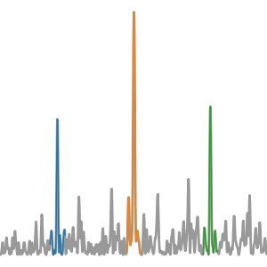

cuvarbase
=========

**GPU-accelerated period-finding and transit-detection algorithms for
astronomical time series**, built on `PyCUDA
<https://documen.tician.de/pycuda/>`_ and `CuPy
<https://docs.cupy.dev/en/v13.6.0/install.html>`_. cuvarbase is designed for
processing whole surveys -- millions of irregularly sampled lightcurves
-- on a single NVIDIA GPU, and its BLS has powered the TESS Quick-Look
Pipeline's planet search since Sector 59 (Kunimoto et al. 2023).

Methods
-------

* :doc:`Box Least Squares (BLS) <bls>` -- the production-validated box
  transit search: standard, adaptive and batched multi-lightcurve GPU
  paths, sparse BLS for small datasets, Keplerian frequency grids and
  selectable power conventions.
* :doc:`Transit Least Squares (TLS) <tls>` -- limb-darkened transit
  templates with a GTLS-compatible observation-level search, full candidate
  and harmonic refinement, and a survey batch wrapper. Thin transits use
  the same default search without phase binning.
* :doc:`Generalized Lomb-Scargle <lomb>` -- NFFT-accelerated, with
  multiharmonic models and Baluev false-alarm probabilities.
* :doc:`Phase Dispersion Minimization (PDM) <pdm>` -- binned and
  binless variants with shared-memory kernels.
* :doc:`Conditional Entropy (CE) <ce>` -- maintained; for an actively
  developed GPU CE search see `periodfind
  <https://github.com/scope-ml/periodfind>`_.
* The **non-equispaced FFT (NFFT)** adjoint
  (:class:`cuvarbase.cunfft.NFFTAsyncProcess`) that powers the fast
  Lomb-Scargle.
* :doc:`NUFFT-LRT <nufft_lrt>` -- an **experimental** likelihood-ratio
  transit search for correlated noise (outside the 1.x stability
  promise; see its page).

Installation
------------

Install the v1 candidate from ``v1.0-fixes``. As of 10 September 2026,
PyPI still provides the older 0.2.5 release.

.. code-block:: bash

    pip install 'cuvarbase @ git+https://github.com/johnh2o2/cuvarbase@v1.0-fixes'

requires an NVIDIA GPU, the CUDA toolkit (``nvcc`` on your ``PATH``) and
Python 3.9-3.14; see :doc:`install` for the details, the optional
extras and the GPU-less install path. The source, issue tracker and
release notes are on `GitHub <https://github.com/johnh2o2/cuvarbase>`_.

Citation
--------

If you use cuvarbase in your research, please cite `Hoffman (2022),
ASCL record ascl:2210.030
<https://ui.adsabs.harvard.edu/abs/2022ascl.soft10030H/abstract>`_:

.. code-block:: bibtex

    @MISC{2022ascl.soft10030H,
           author = {{Hoffman}, John},
            title = "{cuvarbase: GPU-Accelerated Variability Algorithms}",
         keywords = {Software},
     howpublished = {Astrophysics Source Code Library, record ascl:2210.030},
             year = 2022,
            month = oct,
              eid = {ascl:2210.030},
           adsurl = {https://ui.adsabs.harvard.edu/abs/2022ascl.soft10030H},
          adsnote = {Provided by the SAO/NASA Astrophysics Data System}
    }

If you use the sparse BLS method, please also cite `Panahi & Zucker
(2021) <https://arxiv.org/abs/2103.06193>`_; if you use TLS, `Hippke &
Heller (2019) <https://ui.adsabs.harvard.edu/abs/2019A%26A...623A..39H/abstract>`_.

Contents
--------

.. toctree::
   :maxdepth: 2

   whatsnew
   install
   bls
   tls
   lomb
   pdm
   ce
   nufft_lrt
   modules

Indices and tables
==================

* :ref:`genindex`
* :ref:`modindex`
* :ref:`search`
